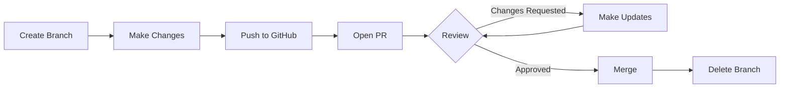

# Understanding Pull Requests (PR) - Hands-On Tutorial

## What is a Pull Request?

Think of it like this:
- **Without PR**: You directly edit the final document (risky!)
- **With PR**: You make a copy, edit the copy, then ask someone to review before merging

### Visual Concept:

```
main branch:     A ─── B ─── C
                              ↑
feature branch:        D ─── E
                              ↑
                         Pull Request
                    "Please review my changes"
```

---

## Hands-On Exercise: Create Your First PR

### Step 1: Create a New Branch

```bash
# You are currently on 'main' branch
git checkout -b add-sum-macro

# This creates and switches to a new branch
# Think of it as making a copy to work on
```

### Step 2: Make Changes (Add New Macro)

Create a new file: `simple-example/calculate_sum.sas`

```sas
/***********************************
* Macro: calculate_sum
* Purpose: Calculate sum of a variable
* Author: Your Name
***********************************/

%macro calculate_sum(data=, var=, output=);
    proc means data=&data sum noprint;
        var &var;
        output out=&output sum=sum_value;
    run;
    
    %put NOTE: Sum calculated successfully;
%mend calculate_sum;
```

### Step 3: Create a Test

Create: `simple-example/test_calculate_sum.sas`

```sas
/***********************************
* Test for calculate_sum macro
***********************************/

data work.test_data;
    input value;
    datalines;
10
20
30
;
run;

%include "calculate_sum.sas";
%calculate_sum(data=work.test_data, var=value, output=work.result);

data _null_;
    set work.result;
    if sum_value = 60 then put "TEST PASSED";
    else put "TEST FAILED";
run;
```

### Step 4: Commit Your Changes

```bash
# Add your new files
git add simple-example/calculate_sum.sas
git add simple-example/test_calculate_sum.sas

# Commit with a message
git commit -m "Add calculate_sum macro with test"

# Push your branch to GitHub
git push origin add-sum-macro
```

### Step 5: Create the Pull Request

1. Go to: https://github.com/YOUR_USERNAME/YOUR_REPO
2. You'll see a yellow banner: "add-sum-macro had recent pushes"
3. Click "Compare & pull request"
4. Fill in:
   - **Title**: "Add calculate_sum macro"
   - **Description**: 
     ```
     ## What this PR does:
     - Adds new calculate_sum macro
     - Includes test file
     - Follows existing patterns
     
     ## Testing:
     - [ ] Tests pass locally
     - [ ] Follows code style
     ```
5. Click "Create pull request"

---

## What Happens Next?

### The PR Flow:



### PR Page Features:

1. **Conversation Tab**: Discussion about changes
2. **Commits Tab**: List of commits in this PR
3. **Files Changed Tab**: See exactly what changed
4. **Checks Tab**: Automated tests run

---

## Common PR Scenarios

### Scenario 1: Simple Addition (Like Our Example)
```bash
# Create branch
git checkout -b add-new-feature

# Make changes
# ... edit files ...

# Commit and push
git add .
git commit -m "Add new feature"
git push origin add-new-feature

# Create PR on GitHub
```

### Scenario 2: Bug Fix
```bash
# Create descriptive branch name
git checkout -b fix-mean-calculation

# Fix the bug
# ... edit calculate_mean.sas ...

# Commit with clear message
git commit -m "Fix: Handle empty datasets in calculate_mean"
git push origin fix-mean-calculation
```

### Scenario 3: Update Documentation
```bash
git checkout -b update-docs
# ... update README.md ...
git commit -m "Docs: Add installation instructions"
git push origin update-docs
```

---

## PR Best Practices

### ✅ DO:
- Keep PRs small and focused
- Write clear descriptions
- Test before creating PR
- Respond to feedback quickly
- Update PR if tests fail

### ❌ DON'T:
- Mix unrelated changes
- Create huge PRs
- Ignore reviewer comments
- Merge without approval
- Delete branches before merging

---

## Reviewing a PR

### As a Reviewer:

1. **Check Files Changed**: Look at the diff
2. **Leave Comments**: Click line numbers to comment
3. **Approve/Request Changes**:
   - ✅ "Approve" - Ready to merge
   - 💬 "Comment" - Just feedback
   - ❌ "Request changes" - Must fix

### Comment Examples:
```
"Great addition! Just one suggestion..."
"This could cause an issue when..."
"Consider using this pattern instead..."
```

---

## Updating Your PR

If changes are requested:

```bash
# Make sure you're on your PR branch
git checkout add-sum-macro

# Make the requested changes
# ... edit files ...

# Commit and push
git add .
git commit -m "Address review feedback"
git push origin add-sum-macro

# The PR automatically updates!
```

---

## Merging the PR

### Three Merge Options:

1. **Merge Commit**: Keeps all commits
   ```
   main: A---B---C---M
                    /
   feature:   D---E
   ```

2. **Squash and Merge**: Combines into one commit
   ```
   main: A---B---C---D'
   ```

3. **Rebase and Merge**: Replays commits
   ```
   main: A---B---C---D---E
   ```

---

## Practice Exercises

### Exercise 1: Your First PR
1. Create branch: `add-max-macro`
2. Add a macro that finds maximum value
3. Create test file
4. Push and create PR
5. Merge when tests pass

### Exercise 2: Fix a Bug
1. Create branch: `fix-typo`
2. Fix a typo in comments
3. Create PR with description
4. Practice squash merge

### Exercise 3: Collaborative PR
1. Create a PR
2. Ask someone to review
3. Address their feedback
4. Get approval and merge

---

## GitHub PR Commands

### Create PR via GitHub CLI:
```bash
# Install GitHub CLI first
gh pr create --title "Add sum macro" --body "Adds calculate_sum"

# View PR status
gh pr status

# Check out someone else's PR
gh pr checkout 123
```

### Useful Git Commands:
```bash
# See all branches
git branch -a

# Switch branches
git checkout branch-name

# Update your branch with latest main
git checkout main
git pull
git checkout your-branch
git merge main

# Delete local branch after merge
git branch -d branch-name
```

---

## Troubleshooting PRs

### "Merge Conflicts"
```bash
# Update your branch
git checkout main
git pull
git checkout your-branch
git merge main
# Fix conflicts in files
git add .
git commit -m "Resolve conflicts"
git push
```

### "Checks Failing"
1. Click "Details" on the failed check
2. Read the error message
3. Fix the issue
4. Push new commit

### "Can't Create PR"
- Make sure you pushed the branch
- Check you have repository access
- Verify branch has changes

---

## Quick PR Checklist

Before creating a PR:
- [ ] Tests pass locally
- [ ] Code follows style guide
- [ ] Branch name is descriptive
- [ ] Commit messages are clear
- [ ] No unrelated changes

PR Description should include:
- [ ] What changes were made
- [ ] Why changes were needed
- [ ] How to test changes
- [ ] Any breaking changes

---

## Your Learning Path

### Week 1: Basics
- Create a simple PR
- Practice the three-step flow
- Merge your first PR

### Week 2: Collaboration
- Review someone else's PR
- Address review feedback
- Try different merge strategies

### Week 3: Advanced
- Handle merge conflicts
- Create PR templates
- Set up branch protection

---

## Summary

Pull Requests are about:
1. **Safety**: Protecting main branch
2. **Review**: Getting feedback
3. **Quality**: Running tests before merge
4. **History**: Tracking why changes were made

Remember: Every PR is a conversation about improving the code!

---

## Next Steps

1. Create the branch for this exercise
2. Add the calculate_sum macro
3. Push and create your first PR
4. Watch the automated tests run
5. Merge when ready!

**Happy PR-ing! 🚀**