# GitHub Actions & CI/CD - Simple Tutorial

## What We'll Build
A simple SAS macro that calculates statistics, with automatic testing every time you make changes.

## Lesson 1: Understanding the Basics

### What is CI/CD in Simple Terms?

Imagine you're writing a book:
- **Without CI/CD**: You write, manually spell-check, manually send to editor, manually publish
- **With CI/CD**: As soon as you save a chapter, spell-check runs automatically, editor gets notified, and if approved, it publishes automatically

### What is GitHub Actions?

GitHub Actions is like having a robot assistant that:
1. **Watches** your code for changes
2. **Runs** tasks automatically (like testing)
3. **Tells** you if something is wrong

---

## Lesson 2: Your First Simple SAS Macro

Let's create a very simple SAS macro that calculates the mean of a variable:

### Step 1: Create the Macro

Create a new file: `simple-example/calculate_mean.sas`

```sas
/***********************************
* Macro: calculate_mean
* Purpose: Calculate mean of a variable
* Author: Your Name
***********************************/

%macro calculate_mean(data=, var=, output=);
    proc means data=&data mean;
        var &var;
        output out=&output mean=mean_value;
    run;
    
    %put NOTE: Mean calculated successfully;
%mend calculate_mean;
```

### Step 2: Create a Test

Create a test file: `simple-example/test_calculate_mean.sas`

```sas
/***********************************
* Test for calculate_mean macro
***********************************/

/* Create test data */
data work.test_data;
    input value;
    datalines;
10
20
30
40
50
;
run;

/* Run the macro */
%calculate_mean(data=work.test_data, var=value, output=work.result);

/* Check if it worked */
data _null_;
    set work.result;
    if mean_value = 30 then do;
        put "TEST PASSED: Mean is correct (30)";
    end;
    else do;
        put "TEST FAILED: Mean is incorrect";
        put "Expected: 30, Got: " mean_value;
    end;
run;
```

---

## Lesson 3: Your First GitHub Action

Now let's create an automation that runs this test automatically!

### Step 1: Create the Workflow File

Create: `.github/workflows/simple-test.yml`

```yaml
name: Simple SAS Test

# When does this run?
on:
  push:                    # Run when you push code
    branches: [ main ]     # Only on main branch
  pull_request:           # Run when someone makes a PR
    branches: [ main ]

jobs:
  test-sas-macro:
    name: Test My SAS Macro
    runs-on: ubuntu-latest    # Use Linux computer
    
    steps:
      # Step 1: Get your code
      - name: Get the code
        uses: actions/checkout@v3
        
      # Step 2: Show what files we have
      - name: List files
        run: |
          echo "Here are my files:"
          ls -la simple-example/
      
      # Step 3: Run a simple check
      - name: Check if test file exists
        run: |
          if [ -f "simple-example/test_calculate_mean.sas" ]; then
            echo "✅ Test file found!"
          else
            echo "❌ Test file not found!"
            exit 1
          fi
      
      # Step 4: Simulate running SAS test
      - name: Simulate SAS test
        run: |
          echo "🔄 Running SAS tests..."
          echo "📊 Testing calculate_mean macro..."
          echo "✅ TEST PASSED: Mean is correct (30)"
          echo "🎉 All tests passed!"
```

---

## Lesson 4: Understanding What Happens

### The Flow:

```mermaid
flowchart LR
    A[You edit calculate_mean.sas] --> B[Push to GitHub]
    B --> C[GitHub Actions starts]
    C --> D[Gets your code]
    D --> E[Runs tests]
    E --> F{Tests pass?}
    F -->|Yes| G[✅ Green check mark]
    F -->|No| H[❌ Red X - Fix needed]
```



### Try It Yourself:

1. **Make a change** to `calculate_mean.sas`
2. **Commit and push**:
   ```bash
   git add simple-example/calculate_mean.sas
   git commit -m "Updated macro"
   git push
   ```
3. **Go to GitHub** → Actions tab
4. **Watch it run!**

---

## Lesson 5: Adding Real SAS Testing

When you have SAS Viya access, update the workflow:

```yaml
name: Real SAS Test

on:
  push:
    branches: [ main ]

jobs:
  test-with-sas-viya:
    runs-on: ubuntu-latest
    
    steps:
      - name: Get code
        uses: actions/checkout@v3
      
      - name: Setup Python
        uses: actions/setup-python@v4
        with:
          python-version: '3.9'
      
      - name: Install dependencies
        run: pip install requests pyyaml
      
      - name: Run SAS test on Viya
        env:
          SAS_VIYA_URL: ${{ secrets.SAS_VIYA_URL }}
          SAS_USER: ${{ secrets.SAS_USERNAME }}
          SAS_PASS: ${{ secrets.SAS_PASSWORD }}
        run: |
          python run_sas_test.py simple-example/test_calculate_mean.sas
```

---

## Lesson 6: Practice Exercises

### Exercise 1: Break the Test
1. Edit `calculate_mean.sas` and introduce an error (like remove a semicolon)
2. Push to GitHub
3. Watch it fail in Actions
4. Fix it and push again
5. Watch it pass

### Exercise 2: Add Another Test
1. Create a new macro `calculate_sum.sas`
2. Create a test for it
3. Update the workflow to test both
4. Push and watch it run

### Exercise 3: Add Notifications
Add this to your workflow to get emailed:
```yaml
      - name: Send notification
        if: failure()
        run: |
          echo "Tests failed! Email would be sent to team."
```

---

## Key Concepts to Remember

### 1. **Trigger Events**
- `on: push` - Runs when you push code
- `on: pull_request` - Runs when PR is created
- `on: schedule` - Runs on a schedule (like every morning)
- `on: workflow_dispatch` - Run manually

### 2. **Job Steps**
Each job has steps that run in order:
1. Checkout code
2. Setup environment
3. Run tests
4. Report results

### 3. **Secrets**
Never put passwords in code! Use secrets:
- Set in: GitHub → Settings → Secrets
- Use in workflow: `${{ secrets.SECRET_NAME }}`

### 4. **Status Badges**
Add this to your README to show test status:
```markdown

```

---

## Common Patterns

### Pattern 1: Test on Multiple Versions
```yaml
strategy:
  matrix:
    sas-version: [9.4, viya3.5, viya4]
```

### Pattern 2: Only Deploy if Tests Pass
```yaml
jobs:
  test:
    # ... test steps ...
  
  deploy:
    needs: test  # Only runs if test succeeds
    if: github.ref == 'refs/heads/main'
    # ... deploy steps ...
```

### Pattern 3: Different Environments
```yaml
jobs:
  deploy-dev:
    if: github.ref == 'refs/heads/develop'
    # ... deploy to dev ...
  
  deploy-prod:
    if: github.ref == 'refs/heads/main'
    # ... deploy to production ...
```

---

## Your Learning Path

### Week 1: Basics
- [ ] Create simple macro and test
- [ ] Push changes and watch Actions run
- [ ] Fix a failing test

### Week 2: Intermediate
- [ ] Add multiple test files
- [ ] Use secrets for credentials
- [ ] Create different workflows for different branches

### Week 3: Advanced
- [ ] Connect to real SAS Viya
- [ ] Add automated deployment
- [ ] Set up notifications

### Week 4: Production Ready
- [ ] Add code quality checks
- [ ] Implement approval workflows
- [ ] Create comprehensive documentation

---

## Troubleshooting Tips

### "My Action isn't running"
- Check: Is it in `.github/workflows/` folder?
- Check: Is the YAML valid? (indentation matters!)
- Check: Did you push to the right branch?

### "Tests pass locally but fail in GitHub"
- Check: Are all files committed?
- Check: Are paths correct? (use forward slashes)
- Check: Are secrets configured?

### "I can't see the Actions tab"
- Actions might be disabled
- Check repository settings
- Ask repository admin

---

## Next Steps

1. **Start Simple**: Use the basic example first
2. **Experiment**: Break things and fix them
3. **Gradually Add**: Add complexity step by step
4. **Ask Questions**: When stuck, check the logs

Remember: CI/CD is about making your life easier. Start simple, and add automation as you need it!

---

## Quick Commands Cheat Sheet

```bash
# Check workflow syntax
cat .github/workflows/simple-test.yml

# See recent runs
# Go to: https://github.com/YOUR_USERNAME/REPO/actions

# Run workflow manually
# Go to Actions → Select workflow → "Run workflow" button

# Check logs
# Click on any workflow run → Click on job → See logs
```

**Happy Learning! 🚀**