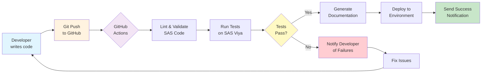
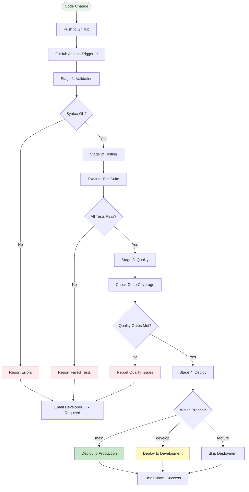
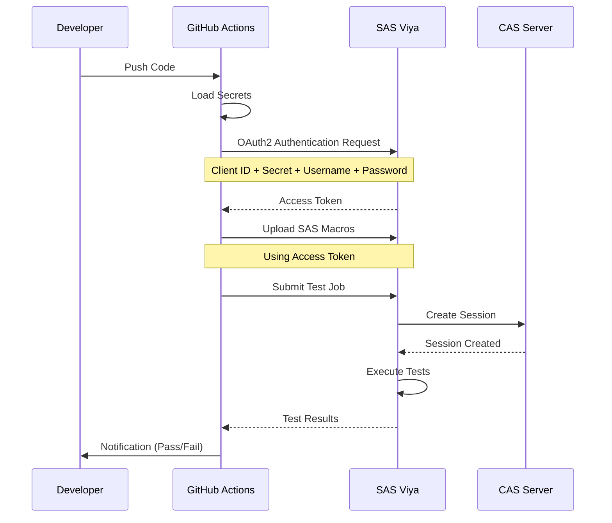
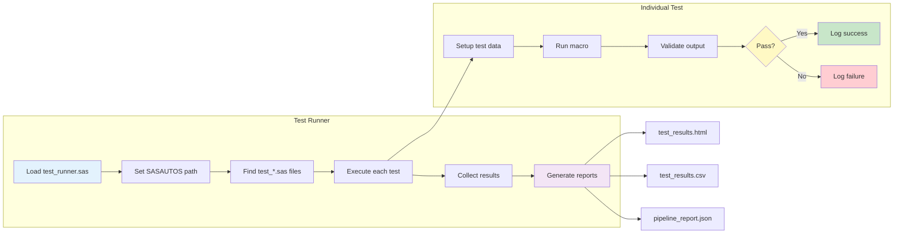
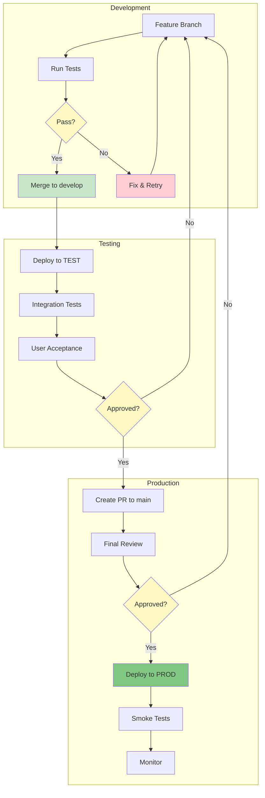
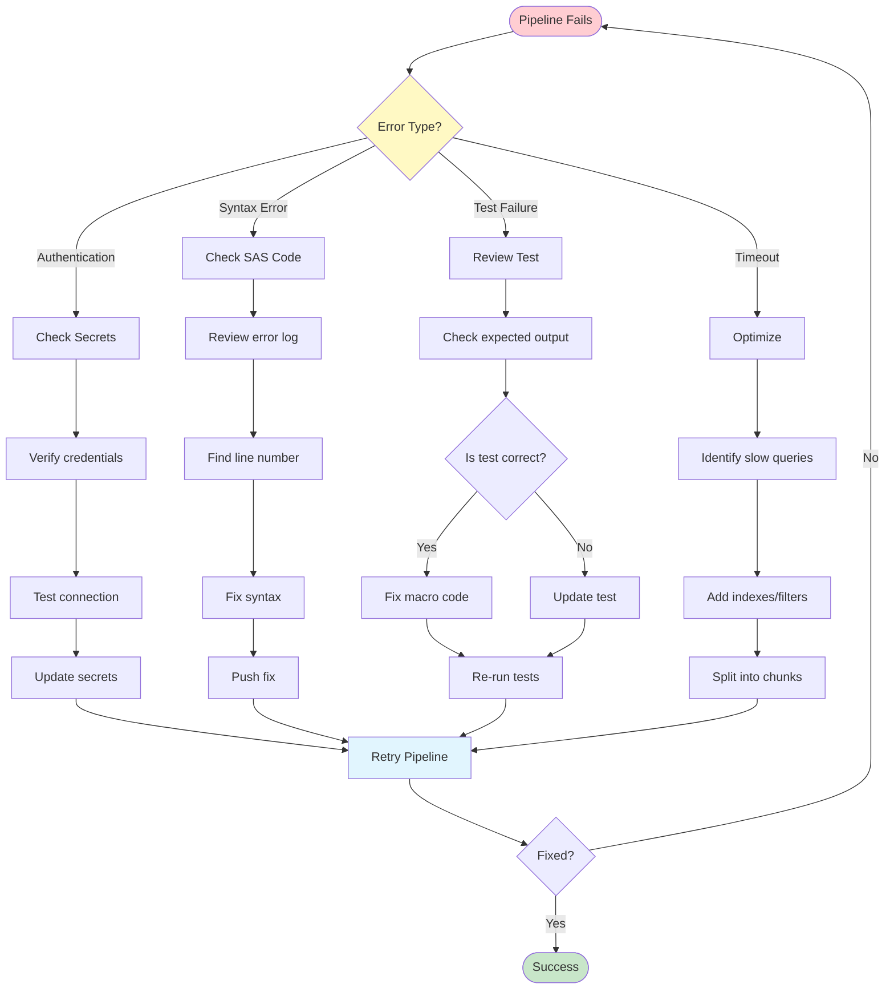

# SAS Clinical Macros CI/CD - User Guide for Beginners

## Table of Contents
1. [What is This Project?](#what-is-this-project)
2. [Understanding CI/CD](#understanding-cicd)
3. [What is GitHub Actions?](#what-is-github-actions)
4. [Getting Started](#getting-started)
5. [Step-by-Step Setup](#step-by-step-setup)
6. [Configuration Management](#configuration-management)
7. [Environment Deployment](#environment-deployment)
8. [How to Use the System](#how-to-use-the-system)
9. [Common Tasks](#common-tasks)
10. [Troubleshooting](#troubleshooting)
11. [Monitoring and Best Practices](#monitoring-and-best-practices)
12. [Glossary](#glossary)

---

## What is This Project?

This project automates the testing and deployment of SAS clinical macros. Think of it as a smart assistant that:
- ✅ Checks your SAS code for errors automatically
- ✅ Runs tests to make sure everything works
- ✅ Deploys your code to SAS Viya servers
- ✅ Generates documentation
- ✅ Notifies your team about changes

**In simple terms:** Instead of manually checking and uploading your SAS code, this system does it for you automatically whenever you save changes.

---

## Understanding CI/CD

### What is CI/CD?

**CI/CD** stands for **Continuous Integration / Continuous Deployment**. Let's break this down:

#### Continuous Integration (CI)
- **What it means:** Every time you save code changes, the system automatically checks if your code works
- **Real-world analogy:** Like spell-check in Microsoft Word, but for programming code
- **What it does:**
  - Checks for syntax errors
  - Runs tests
  - Ensures your changes don't break existing code

#### Continuous Deployment (CD)
- **What it means:** After your code passes all checks, it automatically gets deployed to servers
- **Real-world analogy:** Like auto-save in Google Docs - your approved changes go live automatically
- **What it does:**
  - Uploads validated code to SAS Viya
  - Updates documentation
  - Notifies team members

### Why Use CI/CD?

| Without CI/CD | With CI/CD |
|---------------|------------|
| Manual testing (prone to human error) | Automated testing (consistent) |
| Deploy code manually (time-consuming) | Automatic deployment (saves time) |
| Errors found late | Errors caught immediately |
| Documentation often outdated | Documentation always current |
| Team might not know about changes | Team automatically notified |

### Visual Overview of CI/CD Pipeline



---

## What is GitHub Actions?

**GitHub Actions** is GitHub's built-in automation tool. Think of it as a robot assistant that:
- 🤖 Watches your code repository
- 🤖 Runs tasks when you make changes
- 🤖 Reports results back to you

### How It Works

1. **You push code** → GitHub detects the change
2. **GitHub Actions starts** → Runs predefined workflows
3. **Tasks execute** → Tests, validation, deployment
4. **You get notified** → Success ✅ or Failure ❌

### Detailed Workflow Process



---

## Getting Started

### Prerequisites

Before you begin, you need:

1. **GitHub Account**
   - Sign up at [github.com](https://github.com) if you don't have one
   - Get added to your organization's repository

2. **Access to SAS Viya**
   - Your IT admin should provide:
     - SAS Viya URL
     - Username and password
     - Client ID and Secret

3. **Basic Tools** (optional for local development)
   - Git (for version control)
   - Text editor (VS Code, Notepad++, etc.)
   - Python (if running scripts locally)

---

## Step-by-Step Setup

### Step 1: Fork or Clone the Repository

#### Option A: Using GitHub Web Interface (Easiest)
1. Go to the repository on GitHub
2. Click the "Fork" button (top right)
3. This creates your own copy

#### Option B: Using Git Command Line
```bash
git clone https://github.com/your-org/sas-clinical-macros.git
cd sas-clinical-macros
```

### Step 2: Choose Your CI/CD Platform

#### Option A: GitHub Actions (Recommended)
✅ **Modern, widely adopted**  
✅ **Great integration with SASJS**  
✅ **Excellent artifact handling**

#### Option B: GitLab CI  
✅ **Good for enterprise environments**  
✅ **Built-in container registry**  
✅ **Advanced deployment features**

### Step 3: SAS Viya Connection Setup

#### Authentication Methods Explained Simply:

1. **Client Credentials (Recommended for CI/CD)**
   - Like a service account that doesn't need a human to log in
   - More secure for automated processes  
   - Best for production environments

2. **Username/Password**
   - Like your personal login
   - Good for development and testing
   - Requires actual user accounts

#### Required SAS Viya Information:

```yaml
# You need to collect this information from your SAS Admin:
SAS_VIYA_URL: "https://your-viya-server.com"      # Your SAS Viya server
CAS_SERVER: "cas-shared-default"                   # CAS server name  
COMPUTE_CONTEXT: "Default Compute Context"         # Where jobs run
```

### Step 4: Configure Repository Secrets

Secrets are like passwords that GitHub Actions uses to connect to SAS Viya.

#### For GitHub Actions:
Go to: **Repository Settings → Secrets and Variables → Actions**

**Required Secrets:**
```
VIYA_BASE_URL=https://your-viya-server.com
VIYA_CLIENT_ID=your-app-client-id
VIYA_CLIENT_SECRET=your-app-client-secret
```

**Optional Secrets (for username/password auth):**
```
VIYA_USER=your-username
VIYA_PASS=your-password
```

**Environment-Specific Secrets:**
```
# Staging Environment
VIYA_BASE_URL_STAGING=https://staging-viya.com
VIYA_CLIENT_ID_STAGING=staging-client-id
VIYA_CLIENT_SECRET_STAGING=staging-client-secret

# Production Environment
VIYA_BASE_URL_PROD=https://prod-viya.com
VIYA_CLIENT_ID_PROD=prod-client-id
VIYA_CLIENT_SECRET_PROD=prod-client-secret

# Optional: Teams Notifications
TEAMS_WEBHOOK_URL=https://outlook.office.com/webhook/...
```

#### For GitLab CI:
Go to: **Project Settings → CI/CD → Variables**

Add the same variables with prefix `CI_`:
```
CI_SAS_VIYA_URL
CI_SAS_CLIENT_ID
CI_SAS_CLIENT_SECRET
CI_TEAMS_WEBHOOK_URL
```

### Step 5: Test Your Setup

#### Local Testing:
```bash
# 1. Install SASJS CLI
npm install -g @sasjs/cli

# 2. Set environment variables
export VIYA_BASE_URL=https://your-viya-server.com
export VIYA_CLIENT_ID=your-client-id
export VIYA_CLIENT_SECRET=your-client-secret

# 3. Test authentication
cd sas-clinical-macros
sasjs auth -t viya-dev

# 4. Run tests
sasjs run -t viya-dev -f tests/smoke_test.sas
```

#### CI/CD Testing:
1. Create a small test commit
2. Push to a feature branch
3. Check the pipeline runs successfully
4. Review the logs and artifacts

### Step 6: Understanding the Project Structure

```
sas-clinical-macros/
├── .github/workflows/     # Automation scripts
├── macros/                # Your SAS macro files
├── tests/                 # Test files for your macros
├── docs/                  # Documentation
├── logs/                  # Test results and logs
├── output/                # Generated reports
└── viya/                  # SAS Viya configuration
```

### SAS Viya Authentication Flow



---

## Configuration Management

### Tool Configuration Priority

We recommend using **SASJS CLI as primary tool** because:
- ✅ Industry standard for SAS Viya CI/CD
- ✅ Better error handling
- ✅ Built-in authentication
- ✅ Active community support

### Configuration Hierarchy:
1. **SASJS** (`.sasjsrc`) - Primary tool ⭐
2. **Python Script** (`sas_viya_config.yaml`) - Backup/advanced scenarios
3. **Environment Variables** - CI/CD runtime

### SASJS Configuration Template:

Copy `.sasjsrc.template` to `.sasjsrc` and customize:

```json
{
  "targets": [
    {
      "name": "viya-dev",
      "serverType": "viya",
      "serverUrl": "${VIYA_BASE_URL}",
      "appLoc": "/Public/dev-sas-clinical-macros",
      "contextName": "Default Compute Context",
      "authConfig": {
        "client": "${VIYA_CLIENT_ID}",
        "secret": "${VIYA_CLIENT_SECRET}",
        "grant_type": "client_credentials"
      }
    }
  ],
  "defaultTarget": "viya-dev"
}
```

⚠️ **Important:** Never commit the `.sasjsrc` file with actual credentials!

---

## Environment Deployment

### Environment Strategy:

```
┌─────────────┐    ┌─────────────┐    ┌─────────────┐
│ Development │───▶│   Testing   │───▶│ Production  │
│   (Auto)    │    │   (Auto)    │    │  (Manual)   │
└─────────────┘    └─────────────┘    └─────────────┘
     viya-dev         viya-test         viya-prod
```

### Deployment Triggers:
- **Development**: Every push to `develop` branch
- **Testing**: Every push to `main` branch  
- **Production**: Manual approval after testing

### Environment Configuration:

Each environment has its own:
- SAS Viya server URL
- Folder location (`/Public/dev-*`, `/Public/test-*`, `/Public/prod-*`)
- Compute context
- Authentication credentials

---

## How to Use the System

### Daily Workflow

#### 1. Making Changes to SAS Macros

**Step 1:** Edit your macro file
```sas
/* macros/my_macro.sas */
%macro my_macro(input=, output=);
    /* Your SAS code here */
%mend my_macro;
```

**Step 2:** Save and commit your changes
```bash
git add macros/my_macro.sas
git commit -m "Updated my_macro to handle missing values"
git push
```

**Step 3:** Watch the magic happen!
- Go to GitHub → Actions tab
- See your pipeline running
- Get email when complete

#### 2. Adding New Macros

1. **Create the macro file**
   - Add to `macros/` folder
   - Name it descriptively (e.g., `calculate_statistics.sas`)

2. **Create a test file**
   - Add to `tests/` folder
   - Name it `test_calculate_statistics.sas`

3. **Push to GitHub**
   - The system automatically validates and tests

#### 3. Running Tests Manually

You can trigger tests manually from GitHub:

1. Go to "Actions" tab
2. Select "SAS Viya CI/CD Pipeline"
3. Click "Run workflow"
4. Choose environment (dev/test/prod)
5. Click "Run workflow" button

### Test Execution Process



---

## Common Tasks

### Task 1: Check if Your Code Passed Tests

1. **Go to your repository on GitHub**
2. **Look for status indicators:**
   - ✅ Green checkmark = All tests passed
   - ❌ Red X = Tests failed
   - 🟡 Yellow circle = Tests running

3. **View details:**
   - Click on the indicator
   - See which tests passed/failed
   - Download logs if needed

### Task 2: Deploy to Production

**Automatic deployment** (after approval):
1. Create a pull request to `main` branch
2. Tests run automatically
3. Get approval from reviewer
4. Merge → Automatic deployment

**Manual deployment:**
1. Go to Actions → Run workflow
2. Select "prod" environment
3. Confirm deployment

### Deployment Flow (Dev → Test → Prod)



### Task 3: View Test Reports

1. **After tests run:**
   - Go to Actions tab
   - Click on the workflow run
   - Scroll to "Artifacts"
   - Download "test-results"

2. **What's in the reports:**
   - `test_results.html` - Visual test report
   - `test_results.csv` - Data for analysis
   - `validation_report.html` - Code quality report

### Task 4: Fix Failed Tests

1. **Click on the failed workflow**
2. **Read the error message**
3. **Common fixes:**

   | Error Type | What It Means | How to Fix |
   |------------|---------------|------------|
   | Syntax Error | Code has typos | Check for missing semicolons, quotes |
   | Test Failed | Output doesn't match expected | Update test or fix macro logic |
   | Authentication Failed | Can't connect to SAS | Check secrets in GitHub settings |
   | Timeout | Process took too long | Optimize code or increase timeout |

---

## Troubleshooting

### Problem: "Authentication Failed"

**Symptoms:** Pipeline fails with "401 Unauthorized" or "Authentication failed"

**Solutions:**
1. **Check Repository Secrets**: Verify all secrets are set correctly in GitHub/GitLab
2. **Verify SAS Viya URL**: Ensure the URL is accessible from CI/CD runners
3. **Confirm Credentials**: Check with SAS Admin that client ID/secret are valid
4. **Test Locally**: Try `sasjs auth` command on your machine first
5. **Check Permissions**: Ensure the client has proper SAS Viya permissions

### Problem: "Tests Not Running"

**Symptoms:** "No tests found" or "Test runner failed"

**Solutions:**
1. **Check File Paths**: Verify paths in `test_runner.sas` are correct
2. **Verify Macro Path**: Ensure `sasautos` includes the macros directory
3. **Test File Existence**: Confirm test files exist in `tests/` directory
4. **Check Naming**: Test files should follow `test_*.sas` pattern

### Problem: "Tests are Failing"

**Symptoms:** Red X on your commit

**Solutions:**
1. Click on the failure to see details
2. Read the specific error message
3. Common issues:
   - Missing input files
   - Incorrect macro parameters
   - Syntax errors in SAS code
   - Data type mismatches
   - Missing dependencies

### Problem: "Deployment Failures"

**Symptoms:** "Deployment failed" or "Cannot create folder"

**Solutions:**
1. **Check Folder Permissions**: Verify SAS Viya folder permissions
2. **Verify Compute Context**: Ensure the compute context is available
3. **Validate App Location**: Check that `appLoc` path is valid
4. **Resource Availability**: Confirm SAS Viya has sufficient resources

### Problem: "Pipeline Timeout"

**Symptoms:** Job cancelled after 30 minutes

**Solutions:**
1. Check if SAS Viya is responsive
2. Optimize long-running queries
3. Split large tests into smaller ones
4. Check for infinite loops in SAS code
5. Monitor SAS Viya resource utilization

### Error Handling Flow



### Problem: "Can't See Actions Tab"

**Symptoms:** No Actions tab in GitHub

**Solutions:**
1. Actions might be disabled for repository
2. Contact repository admin
3. Check you have proper permissions

---

## Monitoring and Best Practices

### Pipeline Monitoring

#### Key Metrics to Watch:
- **Test Success Rate**: Should be > 95%
- **Pipeline Duration**: Target < 10 minutes
- **Deployment Frequency**: Track releases per month
- **Mean Time to Recovery**: How quickly we fix issues

#### Dashboard Links:
- **GitHub Actions**: `https://github.com/your-org/sas-clinical-macros/actions`
- **SAS Viya Environment Manager**: `https://your-viya-server.com/SASEnvironmentManager`

### Self-Diagnosis Steps:

When things go wrong, follow this process:

1. **Check Logs**: Always review CI/CD logs first
2. **Test Locally**: Try commands on your machine
3. **Verify Secrets**: Ensure all credentials are set correctly
4. **Check SAS Viya**: Confirm server is accessible and responsive

### Support Resources:

- 🔗 [SASJS Documentation](https://sasjs.io)
- 🔗 [SAS Viya REST API Guide](https://developer.sas.com/apis/rest/)
- 🔗 [GitHub Actions Documentation](https://docs.github.com/en/actions)

### Internal Support:
- 📧 Clinical Programming Team: clinical-programming-team@company.com
- 📋 Create an issue in this repository
- 💬 Teams Channel: #sas-devops

### Training Resources:

#### For Developers:
1. **SASJS CLI Tutorial**: 30 minutes
2. **Git Branching Strategy**: 15 minutes
3. **Writing SAS Tests**: 45 minutes

#### For SAS Administrators:
1. **SAS Viya Security Setup**: 60 minutes
2. **Compute Context Configuration**: 30 minutes  
3. **Monitoring and Troubleshooting**: 45 minutes

### Success Criteria:

Your setup is complete when:
- ✅ CI/CD pipeline runs automatically on code changes
- ✅ Tests pass consistently 
- ✅ Deployments work without manual intervention
- ✅ Team can contribute confidently
- ✅ Documentation is always up-to-date

**Remember**: The goal is reliable, automated delivery of high-quality SAS macros! 🎯

---

## Glossary

| Term | Simple Definition |
|------|-------------------|
| **Repository (Repo)** | A folder that stores all your project files and their history |
| **Commit** | Saving a snapshot of your changes |
| **Push** | Uploading your commits to GitHub |
| **Pull Request (PR)** | Asking to merge your changes into the main code |
| **Branch** | A separate version of your code for development |
| **Workflow** | A set of automated tasks |
| **Pipeline** | The complete process from code to deployment |
| **Artifact** | Files produced by the pipeline (reports, logs) |
| **Secret** | Encrypted passwords/credentials stored in GitHub |
| **Environment** | Where your code runs (dev/test/prod) |
| **Webhook** | Automatic notification system |
| **YAML** | Configuration file format (.yml files) |

### Essential Commands

```bash
# Get the code
git clone [repository-url]

# Save your changes
git add .
git commit -m "Description of changes"
git push

# Update your local code
git pull

# Create a new branch
git checkout -b feature/my-new-feature

# Switch branches
git checkout main
```

### Essential URLs

- **Your Repository:** `https://github.com/[your-org]/sas-clinical-macros`
- **Actions (CI/CD):** `https://github.com/[your-org]/sas-clinical-macros/actions`
- **Settings:** `https://github.com/[your-org]/sas-clinical-macros/settings`
- **Pull Requests:** `https://github.com/[your-org]/sas-clinical-macros/pulls`

### Essential Files to Know

| File | Purpose |
|------|---------|
| `.github/workflows/*.yml` | Defines what CI/CD does |
| `macros/*.sas` | Your SAS macro code |
| `tests/*.sas` | Tests for your macros |
| `.env` | Local configuration (never commit!) |
| `README.md` | Project documentation |

---

## Quick Reference Card

### Setup Checklist

- [ ] Choose your Git platform (GitHub or GitLab)
- [ ] Configure SAS Viya credentials with your admin
- [ ] Set up repository secrets
- [ ] Copy and customize `.sasjsrc.template` to `.sasjsrc`
- [ ] Test authentication with `sasjs auth`
- [ ] Run smoke tests successfully
- [ ] Set up team notifications

---

## Tips for Success

### 🎯 Best Practices

1. **Test locally first** (if possible)
2. **Write clear commit messages**
3. **Keep macros small and focused**
4. **Always write tests for new macros**
5. **Document your code**

### ⚠️ Things to Avoid

1. **Don't commit passwords** (use secrets)
2. **Don't skip tests** (they catch errors)
3. **Don't work directly on main branch**
4. **Don't ignore failing tests**
5. **Don't forget to pull latest changes**

### 🚀 Pro Tips

1. **Use branch protection** - Prevents accidental changes to main
2. **Set up notifications** - Stay informed about pipeline status
3. **Review logs regularly** - Spot issues early
4. **Keep documentation updated** - Helps team members
5. **Use meaningful names** - For files, variables, and commits

---

## Conclusion

Congratulations! You now have a comprehensive understanding of:
- ✅ **CI/CD concepts** and why they're valuable for SAS development
- ✅ **Complete setup process** for GitHub Actions and GitLab CI
- ✅ **Configuration management** with SASJS CLI and environment variables
- ✅ **Authentication methods** and security best practices
- ✅ **Environment deployment** strategies (dev → test → prod)
- ✅ **Monitoring and troubleshooting** techniques
- ✅ **Daily workflow** for productive SAS macro development

### Key Takeaways:

1. **SASJS CLI is the recommended standard** for SAS Viya CI/CD
2. **Client credentials authentication** is most secure for automated processes
3. **Environment separation** ensures safe promotion of changes
4. **Automated testing** catches issues before they reach production
5. **Pipeline monitoring** helps maintain system health

Remember: CI/CD transforms SAS macro development from manual, error-prone processes into automated, reliable workflows. The initial setup investment pays dividends in reduced errors, faster deployments, and team confidence.

**Start small, test thoroughly, and expand gradually. Happy automating! 🚀**

---

*Last updated: 2025*
*Version: 2.0 - Comprehensive Setup & Configuration Guide*